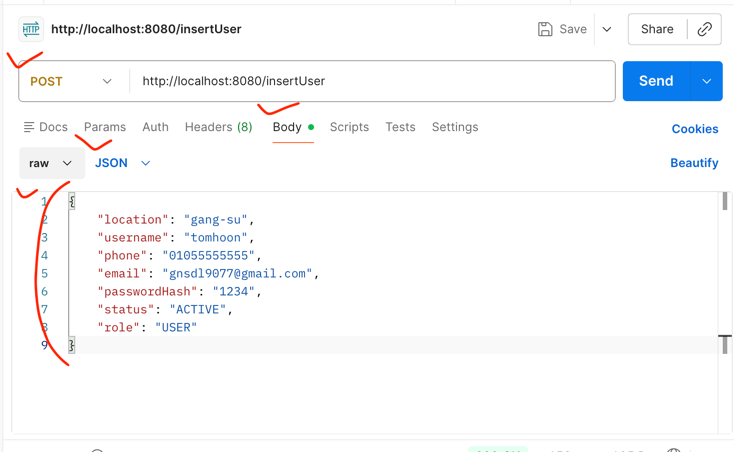

# API 추가시 추가 순서(예시)
1. src/main/resources/mapper/user/UserMapper.xml 내에 쿼리 추가
2. src/main/com.food.delivery/user/mapper/UserMapper.java에 메소드 추가
3. src/main/com.food.delivery/user/service/UserService.java에 메소드 및 로직 추가
4. src/main/com.food.delivery/user/service/UserController.java에 POST/GET 엔드포인트 추가

# POST 맨으로 Post 보내기

